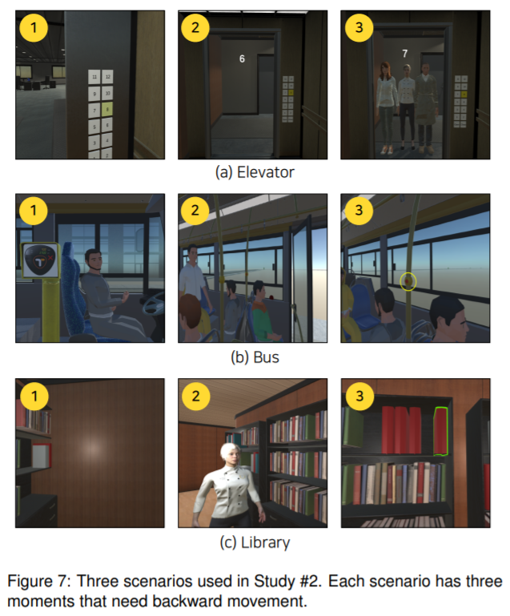

# IEEE_VR_2021_Backward_Movement

I Feel More Engaged When I Move!: Deep Learning-based Backward Movement Detection and its Application [VR 2021]

> **I Feel More Engaged When I Move!: Deep Learning-based Backward Movement Detection and its Application** [[PDF]](https://www.researchgate.net/profile/Patrick-Shih-2/publication/349943171_I_Feel_More_Engaged_When_I_Move_Deep_Learning-based_Backward_Movement_Detection_and_its_Application/links/604831ea92851c077f2b1325/I-Feel-More-Engaged-When-I-Move-Deep-Learning-based-Backward-Movement-Detection-and-its-Application.pdf) [[Video]](https://www.youtube.com/watch?v=vByEPQUFGKI)      
> Seungwon Paik, Youngseung Jeon, Patrick C. shih, Kyungsik Han  
> VR 2021 

  

Highlights
-----------------
- **Backward Movement:** XXX
- **Novelty:** XXX
- **Efficacy:** XXX
- **Simple:** XXX

Abstract
-----------------
>Movement is one of the key elements in virtual reality (VR) and significantly influences user experience. In particular, walking-inplace is a method of supporting movement in a limited space, and many studies are being conducted on its effective support. However, most studies have focused on forward movement despite many situations in which backward movement is needed. In this paper, we present the development of a prediction model for forward/backward movement while considering a user’s orientation and the verification of the model’s effectiveness. We built a deep learning-based model by collecting sensor data on the movement of the user’s head, waist, and feet. We developed three realistic VR scenarios that involve backward movement, set three conditions (controller-based, treadmill-based, and model-based) for movement, and evaluated user experience in each condition through a study of 36 participants. As a result, the model-based condition showed the highest sensory sensitivity, effectiveness, and satisfaction and similar cognitive burden compared with the other two conditions. The results of our study demonstrated that movement support through modeling is possible, suggesting its potential for use in many VR applications.

